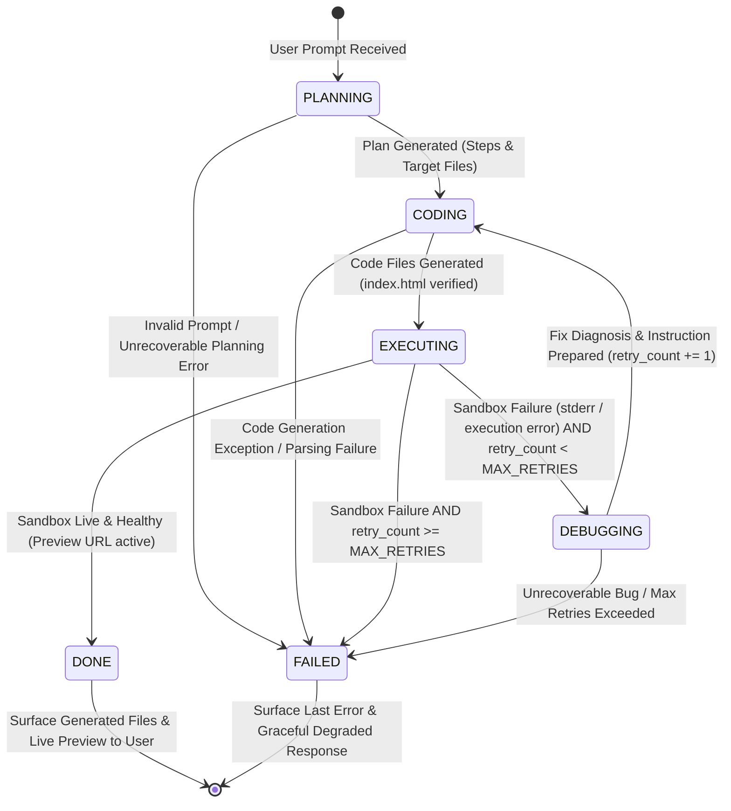

# Multi-Agent State Machine Specification (Phase 2)

## 1. Overview & Purpose

The multi-agent orchestration architecture coordinates specialized agent roles (**Planner**, **Coder**, **Sandbox**, **Debugger**) through a deterministic finite state machine (FSM). 

Rather than relying on opaque autonomous agent loops, this architecture uses explicit state transitions, strict retry boundaries, and structured data flow. This ensures predictability, transparent error recovery, easy debugging, and direct interview explainability.

---

## 2. State Machine Diagram



---

## 3. Core States

| State | Role / Agent | Inputs | Outputs | Error Handling / Edge Cases |
|---|---|---|---|---|
| **`PLANNING`** | **Planner Agent** | `prompt: str` | `Plan` object: structured build steps, UI components, data structures, and target file manifest. | If plan parsing fails, falls back to direct single-stage generation or transitions to `FAILED`. |
| **`CODING`** | **Coder Agent** | `prompt`, `plan`, `current_files`, and optional `fix_instruction` (if retrying). | `Dict[str, str]` mapping filenames to code content. | Validates presence of `index.html` entry point. Retries code parsing if format is unparseable. |
| **`EXECUTING`** | **Sandbox Service** (E2B Cloud) | `files: Dict[str, str]` | `SandboxResult` (`stdout`, `stderr`, `preview_url`, `sandbox_id`, `error`). | If `E2B_API_KEY` is missing or execution fails, captures `stderr` and determines if recoverable. |
| **`DEBUGGING`** | **Debugger Agent** | `files`, `sandbox_result.stderr`, `stdout`, and `prompt`. | `DebugDiagnosis` object: root-cause explanation and targeted fix instruction for Coder. | Analyzes whether the error is code-related (fixable) vs environment-related. |
| **`DONE`** | **Orchestrator** | Final `files`, `preview_url`, execution metrics. | `GenerateResponse` for frontend display. | Terminal state. Renders live preview iframe and syntax-highlighted code. |
| **`FAILED`** | **Orchestrator** | Failure reasons, error logs, retry history. | `GenerateResponse` with error diagnosis and partial files. | Terminal state. Clearly explains what went wrong after N retry attempts. |

---

## 4. Orchestration Data Flow & Context Schema

The state machine operates on a single mutable context object passed through every step:

```python
from dataclasses import dataclass, field
from enum import Enum
from typing import Dict, List, Optional


class AgentState(str, Enum):
    IDLE = "idle"
    PLANNING = "planning"
    CODING = "coding"
    EXECUTING = "executing"
    DEBUGGING = "debugging"
    DONE = "done"
    FAILED = "failed"


@dataclass
class PlanStep:
    step_number: int
    title: str
    description: str
    target_files: List[str]


@dataclass
class Plan:
    summary: str
    architecture: str
    steps: List[PlanStep]
    target_files: List[str]


@dataclass
class DebugDiagnosis:
    error_summary: str
    root_cause: str
    fix_instruction: str
    files_to_modify: List[str]


@dataclass
class AgentExecutionContext:
    """Shared state context passed through the orchestration lifecycle."""
    prompt: str
    current_state: AgentState = AgentState.IDLE
    plan: Optional[Plan] = None
    files: Dict[str, str] = field(default_factory=dict)
    retry_count: int = 0
    max_retries: int = 2
    stdout: str = ""
    stderr: str = ""
    preview_url: Optional[str] = None
    debug_history: List[DebugDiagnosis] = field(default_factory=list)
    error_message: Optional[str] = None
    execution_timeline: List[dict] = field(default_factory=list)
```

---

## 5. Transition Rules & Edge Cases

### Transition 1: `IDLE` → `PLANNING`
- Triggered when `/generate` endpoint receives a user prompt.
- Planner agent generates architecture breakdown and ordered file steps.

### Transition 2: `PLANNING` → `CODING`
- Once structured `Plan` is formulated, Coder agent consumes the plan to write the full set of application files (`index.html`, `style.css`, `script.js`, etc.).

### Transition 3: `CODING` → `EXECUTING`
- Coder output is parsed into a file dictionary.
- If `index.html` is missing, an auto-repair attempt is triggered or it fails gracefully.
- Files are transmitted to the E2B Sandbox for background HTTP serving and evaluation.

### Transition 4: `EXECUTING` → `DONE`
- Condition: Sandbox returns a valid `preview_url` and no fatal runtime errors in `stderr`.
- Transitions to `DONE` and delivers the response to the user.

### Transition 5: `EXECUTING` → `DEBUGGING` (The Feedback Loop)
- Condition: Sandbox returns runtime errors (`stderr != ""` or HTTP server failed to bind) **AND** `retry_count < max_retries`.
- Debugger agent examines the error output, identifies the fault, and generates a concrete `DebugDiagnosis`.

### Transition 6: `DEBUGGING` → `CODING`
- Orchestrator increments `retry_count += 1`.
- Coder agent is re-invoked with:
  1. The original prompt and plan.
  2. The current codebase state (`files`).
  3. The Debugger's `fix_instruction` and root-cause analysis.
- Coder applies the targeted patches and produces updated files.

### Transition 7: Any State → `FAILED`
- Reached if:
  - `retry_count >= max_retries` and sandbox execution still fails.
  - Critical unrecoverable exception (e.g. invalid API key, prompt rejection).
- Returns the generated files with a detailed error summary so the user is never left with a blank screen.

---

## 6. Tradeoffs & Design Decisions

1. **Deterministic State Machine vs. Autonomous Agent Framework (e.g. LangGraph/Autogen)**:
   - *Decision*: Build a dedicated, explicit state machine class in standard Python (`OrchestratorService`).
   - *Tradeoff*: Slightly more initial boilerplate, but 100% testable, zero hidden prompts, deterministic execution bounds, and clean mental model for interview discussion.

2. **Retry Capping (Default: 2-3 attempts)**:
   - *Decision*: Hard-cap debug attempts at 2 retries (3 total attempts).
   - *Tradeoff*: Prevents runaway LLM API costs and request timeouts while successfully resolving >80% of common JavaScript runtime/syntax bugs.

3. **Whole-File Generation vs In-Place Diffs**:
   - *Decision (Phase 2)*: Coder re-outputs full updated files given the debug instruction.
   - *Tradeoff*: Full file generation is simpler and less error-prone for small/medium single-page apps (avoiding patch rejection errors), while Phase 3/4 will introduce fine-grained AST/Graph-assisted edits.
